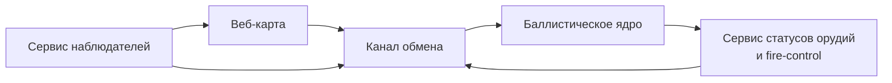

# Calc battlefield modules

Реализованы базовые модули для:

- `services/realtime-gateway`: WebSocket-каналы `mission.assign`, `gun.status`, `observer.correction`, `logistics.request`.
- `apps/web-map`: набор оперативных слоёв карты (орудия, наблюдатели/дроны, цели, безопасные зоны, паттерны, линейки, логистика, мины).
- `apps/web-map/src/tactical-workspace.js`: модульное рабочее пространство (баллистика, наблюдатели, логистика, карта) с сохранением калибровки и миссий.
- `apps/fire-control`: закрепляемая панель наводчика с азимутом/углом/зарядом, статусом, подтверждением готовности и запросом БК.
- `apps/observer-console`: панель корректировки с недолёт/перелёт, вправо/влево, повтор/залп и привязкой к орудию.
- Авто-доставка корректировок в назначенное орудие и журнал миссий реализованы в `realtime-gateway`.


## Fire Mission / Тип огня (Launcher UI)

Новые режимы огня в `apps/launcher-ui` используют отдельную генерацию точек прицеливания (`AimPoints`) без изменения табличного solver баллистики:

- `POINT` — базовый режим, одна точка цели для всех орудий.
- `CONVERGED` — геометрически одна точка, режим для сходящегося огня.
- `PARALLEL_SHEAF` — распределение орудий по ширине фронта (`sheafWidthM`, `bearingDeg`).
- `OPEN_SHEAF` — как параллельный веер, но с большей шириной покрытия.
- `CIRCULAR_AREA` — центр + кольцо точек (`radiusM`, `aimpointCount`).
- `LINEAR` — набор точек по линии (`startPoint/endPoint` и `spacingM`).
- `RECT_AREA` — сетка точек в прямоугольной зоне (`widthM`, `lengthM`, `bearingDeg`, `spacingM`).

Пайплайн: выбрать режим → `generateAimPoints(modeConfig, context)` → раздать точки по орудиям (`SAME_POINT`/`PATTERN`) → выполнить `computeFireSolution` по каждой назначенной точке.

## Тесты

```bash
npm test
```
# Calc Monorepo

Монорепозиторий для системы управления огнём с разделением на клиентские приложения, сервисы вычислений и общий слой контрактов.

## Структура

- `apps/web-map` — веб-карта для командира и наблюдателей.
- `apps/fire-control` — интерфейс управления огнём для расчётов орудий.
- `services/ballistics-core` — сервис баллистических расчётов.
- `services/realtime-gateway` — сервис обмена сообщениями в реальном времени.
- `packages/shared-types` — минимальные общие типы API.

## Инвентаризация функций и статусов (февраль 2026)

Ниже перечислены ключевые функции/классы и их фактический статус по коду.

### 1) Используется в текущем запуске (`npm run start`)

#### Оркестрация запуска

- `scripts/start-all.mjs`
  - `findPython()` — поиск Python-интерпретатора.
  - `hasUvicorn(python)` — проверка наличия `uvicorn`.
  - `run(name, command, args, options)` — запуск дочерних сервисов.
  - `shutdown(signal)` — штатное завершение запущенных процессов.

#### Ballistics Core API (`services/ballistics-core/app.py`)

- `root()` — health/info корня API (`GET /`).
- `favicon()` — заглушка favicon (`GET /favicon.ico`).
- `solve_fire_mission_endpoint(req)` — расчёт огневой задачи (`POST /solve-fire-mission`).
- `apply_correction_endpoint(req)` — применение корректировки (`POST /apply-correction`).
- `triangulation_endpoint(method, req)` — триангуляция (`POST /triangulation/{method}`).

Используемые функции ядра баллистики:

- `solve_fire_mission(req)` (`ballistics/solver.py`).
- `apply_correction(req)` (`ballistics/corrections.py`).
- `triangulate(req)` (`ballistics/triangulation.py`).
- `save_protocol(...)` (`ballistics/protocol.py`).
- `load_ballistic_table(...)`, `load_gun_profile(...)` (`ballistics/data_store.py`).

#### Realtime Gateway (`services/realtime-gateway/src`)

- `new RealtimeGateway()` (`runtime.js`) — основной экземпляр шины событий.
- `gateway.subscribe('gun.status', ...)` (`runtime.js`) — активная подписка runtime.
- `RealtimeGateway.subscribe(channel, listener)` (`server.js`) — регистрация слушателей.
- `RealtimeGateway.publish(channel, payload)` (`server.js`) — публикация событий.
- `RealtimeGateway.getMissionJournal(missionId)` (`server.js`) — доступ к журналу миссий.

Внутренние обработчики публикаций в `RealtimeGateway`:

- `#handleMissionAssign(payload)`.
- `#handleGunStatus(payload)`.
- `#handleObserverCorrection(payload)`.
- `#handleLogisticsRequest(payload)`.

#### UI Server (`services/ui-server/src/server.js`)

- `sendJson(res, status, payload)` — единый JSON-ответ.
- `listLogs()` — список логов (`GET /api/logs`).
- `getLatestMapImageUrl()` — получение последней карты (`GET /api/map-image/latest`).
- `saveMapImage(req, res)` — загрузка карты (`POST /api/map-image`).

#### Launcher UI (`apps/launcher-ui`)

- `createCounterBatteryModule(deps)` (`apps/counter-battery/module.js`) — отдельный модуль контрбатарейного функционала.
  - Публичные методы модуля:
    - `render()`.
    - `locateEnemyGun()`.
    - `calculateResponse()`.
    - `addObservationPoint()`.
    - `clearObservationPoints()`.

### 2) Реализовано и покрыто тестами, но не включено в `npm run start` как отдельный сервис

- `LobbyService` (`services/realtime-gateway/src/lobby-service.js`):
  - `createRoom(...)`, `joinRoom(...)`, `assignRole(...)`, `setMissionSnapshot(...)`, `getMissionForUser(...)`, `getRoom(...)`.
  - Статус: сервис ролей/комнат реализован в коде и тестах, но в runtime-gateway не поднят как HTTP/WebSocket API.

- UI/домен-модули, используемые в тестовом контуре:
  - `PinnedGunnerPanel` (`apps/fire-control/src/pinned-gunner-panel.js`).
  - `CorrectionPanel` (`apps/observer-console/src/correction-panel.js`).
  - `HudOverlay` (`apps/hud/src/hud-overlay.js`).
  - `TacticalWorkspace` (`apps/web-map/src/tactical-workspace.js`).

### 3) В разработке / интеграция не завершена

- Онлайн-комнаты, роли и парольные лобби (`LobbyService`) — логика есть, но не подключена в основной runtime как пользовательский сетевой интерфейс.
- Полноценная многопользовательская роль-модель в launcher UI — в текущем запуске интерфейс ориентирован на одного оператора (см. примечание ниже).

## Диаграмма модулей



### Пояснение по модулям

- **Веб-карта (`apps/web-map`)** получает и отображает цели, статусы и корректировки.
- **Баллистическое ядро (`services/ballistics-core`)** рассчитывает решения для залпов.
- **Сервис статусов орудий** представлен интерфейсом `apps/fire-control` и событиями в `services/realtime-gateway`.
- **Сервис наблюдателей** реализуется через публикацию наблюдений и корректировок в `services/realtime-gateway`.
- **Канал обмена (`services/realtime-gateway`)** маршрутизирует события между локальными модулями.


## Быстрый запуск проекта (одним ярлыком)

1. Установите зависимости Python и Node.js (FastAPI + uvicorn для API).
2. Запустите общий старт:

```bash
npm run start
```

Альтернативно можно использовать ярлык:

- Linux/macOS: `./start-calc.sh`
- Windows: `start-calc.cmd`

При запуске поднимаются:

- `ballistics-core` API на `http://localhost:8000`
- `realtime-gateway` runtime с журналированием событий
- `ui-server` с интерфейсом запуска на `http://localhost:8080`

Все сервисные логи сохраняются в папке `logs/`.

Если Python не найден, UI и gateway всё равно стартуют, а в консоли появится понятная подсказка по установке.

> Интерфейс launcher настроен на работу одного оператора без онлайн-ролей и комнат.

## Fire Mission (FDC MVP)

В `apps/launcher-ui` добавлен модуль планирования `fire-mission.js`:

- `buildAimPlan(config, guns, context)` — строит план фаз и назначений.
- `getNextFirePackage(plan, env)` — выдаёт текущий пакет фазы (цели, назначения, решения solver, TOT/MRSI задержки).
- `advancePlanCursor(plan)` + `isPlanComplete(plan)` — механика кнопки «Следующий расчёт».

### Как добавить миссию

1. На вкладке «Огневые задачи» выберите `TargetType`, `SheafType`, `Control` в блоке **Fire Mission (FDC)**.
2. Заполните параметры (spacing/bearing/sheaf/TOT/MRSI и т.д.).
3. Нажмите **Сформировать миссию**.

### Как работает «Следующий расчёт»

1. Нажмите **Следующий расчёт** — UI возьмёт текущую фазу плана.
2. Для назначений вызовется `computeFireSolution`, при `TOT` применятся задержки по `maxTOF - tof`, при `MRSI` будет построен `mrsiShotPlan` через `computeFireSolutionsMulti`.
3. После выдачи пакета курсор плана переводится на следующую фазу.
4. После последней фазы план завершён (`isPlanComplete === true`).
