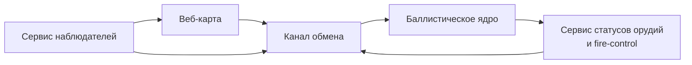

# Calc Monorepo

Монорепозиторий для системы управления огнём с разделением на клиентские приложения, сервисы вычислений и общий слой контрактов.

## Структура

- `apps/web-map` — веб-карта для командира и наблюдателей.
- `apps/fire-control` — интерфейс управления огнём для расчётов орудий.
- `services/ballistics-core` — сервис баллистических расчётов.
- `services/realtime-gateway` — сервис обмена сообщениями в реальном времени.
- `packages/shared-types` — минимальные общие типы API.

## Диаграмма модулей

### Пояснение по модулям

- **Веб-карта (`apps/web-map`)** получает и отображает цели, статусы и корректировки.
- **Баллистическое ядро (`services/ballistics-core`)** рассчитывает решения для залпов.
- **Сервис статусов орудий** представлен интерфейсом `apps/fire-control` и событиями в `services/realtime-gateway`.
- **Сервис наблюдателей** реализуется через публикацию наблюдений и корректировок в `services/realtime-gateway`.
- **Канал обмена (`services/realtime-gateway`)** маршрутизирует события между ролями и сервисами.
