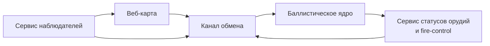

# Calc battlefield modules

Реализованы базовые модули для:

- `services/realtime-gateway`: WebSocket-каналы `mission.assign`, `gun.status`, `observer.correction`, `logistics.request`.
- `apps/web-map`: набор оперативных слоёв карты (орудия, наблюдатели/дроны, цели, безопасные зоны, паттерны, линейки, логистика, мины).
- `apps/fire-control`: закрепляемая панель наводчика с азимутом/углом/зарядом, статусом, подтверждением готовности и запросом БК.
- `apps/observer-console`: панель корректировки с недолёт/перелёт, вправо/влево, повтор/залп и привязкой к орудию.
- Авто-доставка корректировок в назначенное орудие и журнал миссий реализованы в `realtime-gateway`.

## Тесты

```bash
npm test
```
# Calc Monorepo

Монорепозиторий для системы управления огнём с разделением на клиентские приложения, сервисы вычислений и общий слой контрактов.

## Структура

- `apps/web-map` — веб-карта для командира и наблюдателей.
- `apps/fire-control` — интерфейс управления огнём для расчётов орудий.
- `services/ballistics-core` — сервис баллистических расчётов.
- `services/realtime-gateway` — сервис обмена сообщениями в реальном времени.
- `packages/shared-types` — минимальные общие типы API.

## Диаграмма модулей



### Пояснение по модулям

- **Веб-карта (`apps/web-map`)** получает и отображает цели, статусы и корректировки.
- **Баллистическое ядро (`services/ballistics-core`)** рассчитывает решения для залпов.
- **Сервис статусов орудий** представлен интерфейсом `apps/fire-control` и событиями в `services/realtime-gateway`.
- **Сервис наблюдателей** реализуется через публикацию наблюдений и корректировок в `services/realtime-gateway`.
- **Канал обмена (`services/realtime-gateway`)** маршрутизирует события между ролями и сервисами.


## Быстрый запуск проекта (одним ярлыком)

1. Установите зависимости Python и Node.js (FastAPI + uvicorn для API).
2. Запустите общий старт:

```bash
npm run start
```

Альтернативно можно использовать ярлык:

- Linux/macOS: `./start-calc.sh`
- Windows: `start-calc.cmd`

При запуске поднимаются:

- `ballistics-core` API на `http://localhost:8000`
- `realtime-gateway` runtime с журналированием событий
- `ui-server` с интерфейсом запуска на `http://localhost:8080`

Все сервисные логи сохраняются в папке `logs/`.

Если Python не найден, UI и gateway всё равно стартуют, а в консоли появится понятная подсказка по установке.
